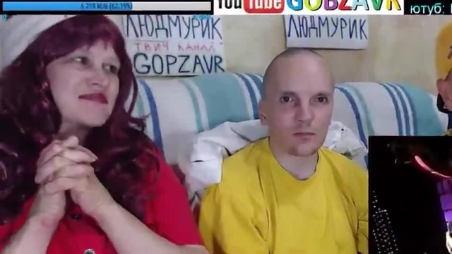
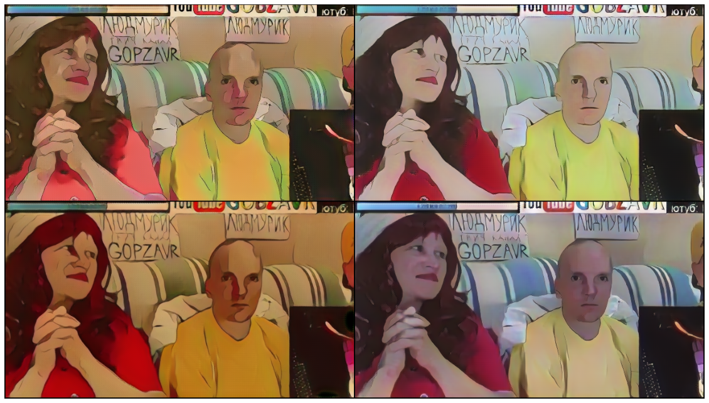

# CartoonGAN-Test-Pytorch-Torch
Pytorch and Torch testing code of [CartoonGAN](http://openaccess.thecvf.com/content_cvpr_2018/CameraReady/2205.pdf) `[Chen et al., CVPR18]`. With the released pretrained [models](http://cg.cs.tsinghua.edu.cn/people/~Yongjin/Yongjin.htm) by the authors.

## Getting started

- Linux
- NVIDIA GPU


Original repo places here https://github.com/Yijunmaverick/CartoonGAN-Test-Pytorch-Torch
```
git clone https://github.com/MalchuL/CartoonGAN-Test-Pytorch-Jupyter
cd CartoonGAN-Test-Pytorch-Jupyter
```

## Pytorch

- Download the converted models:

```
sh pretrained_model/download_pth.sh
```

Install requirements:
```
pip install -r requirements.txt
```

- For testing:
To process single style
```
python test.py --input_dir YourImgDir --style Hosoda --gpu 0
```
To process all available styles:
```
python multitest.py --load_size=920
```


## Examples (First: input, Second: output)

<p>
    
    
</p>

# Note
Also here available run from Jupyter Notebook
